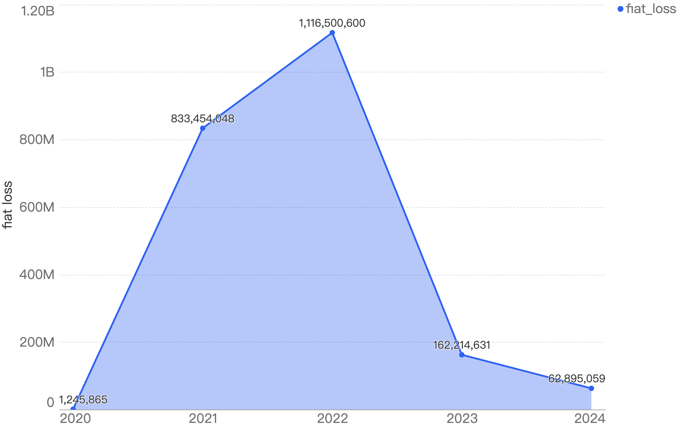
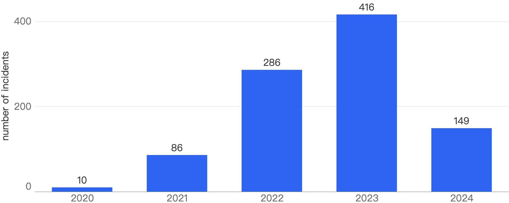
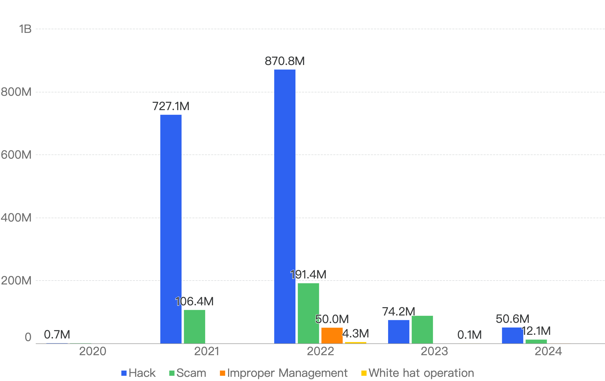
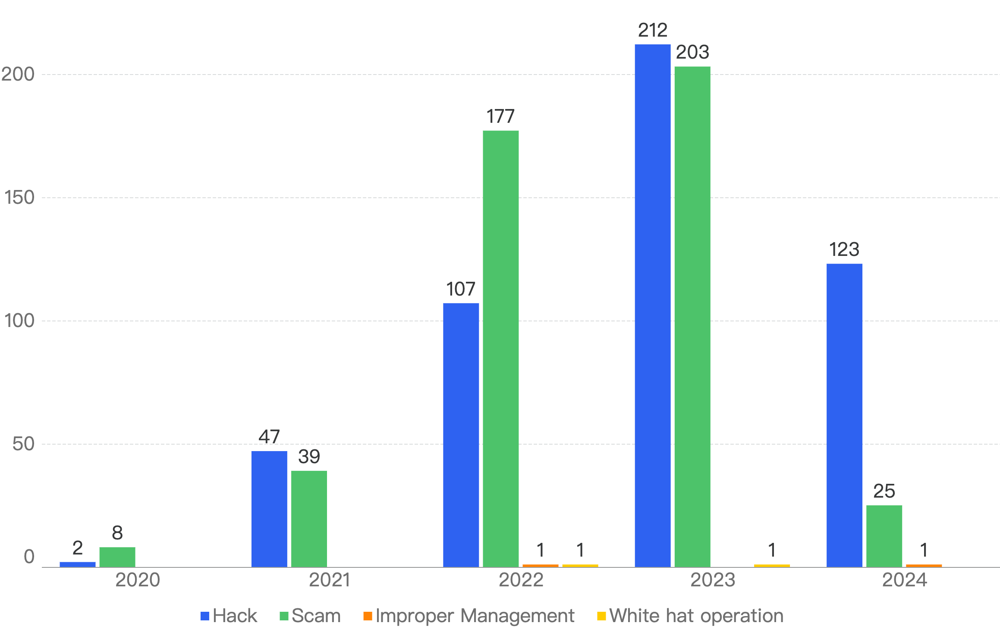
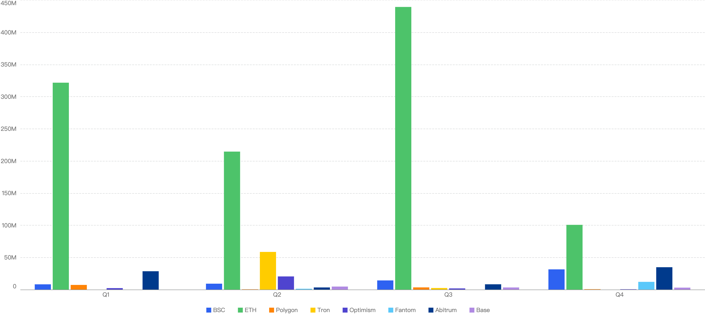
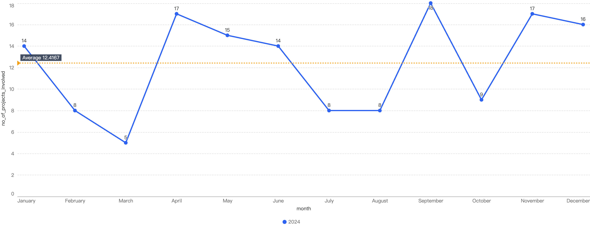
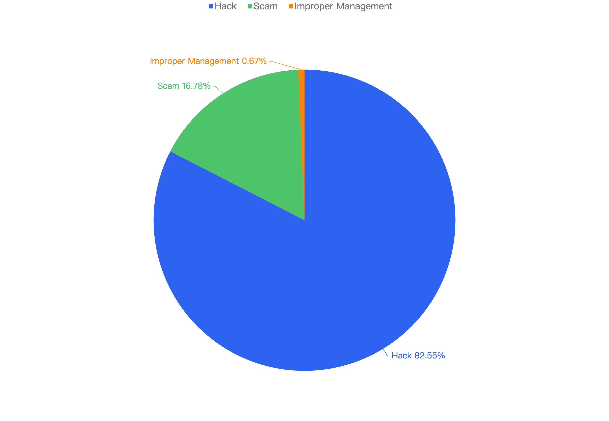
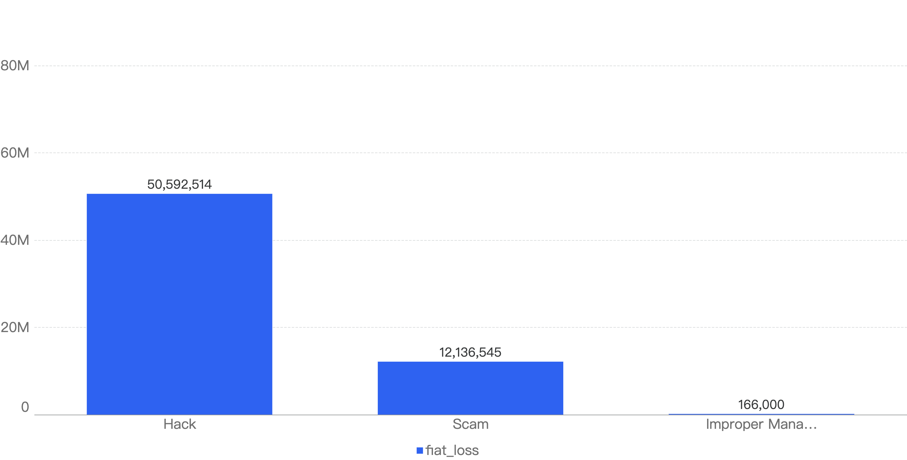
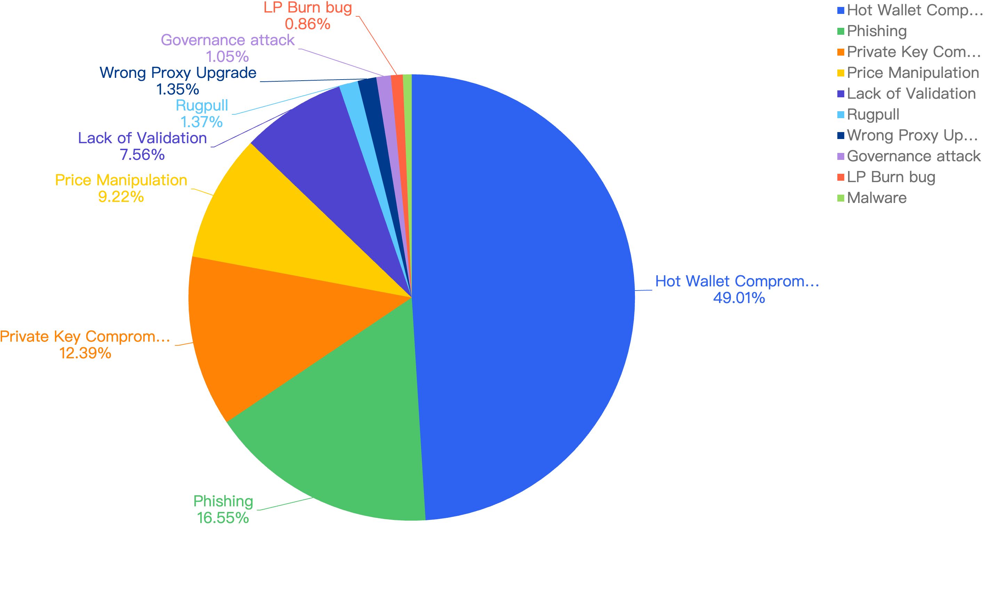
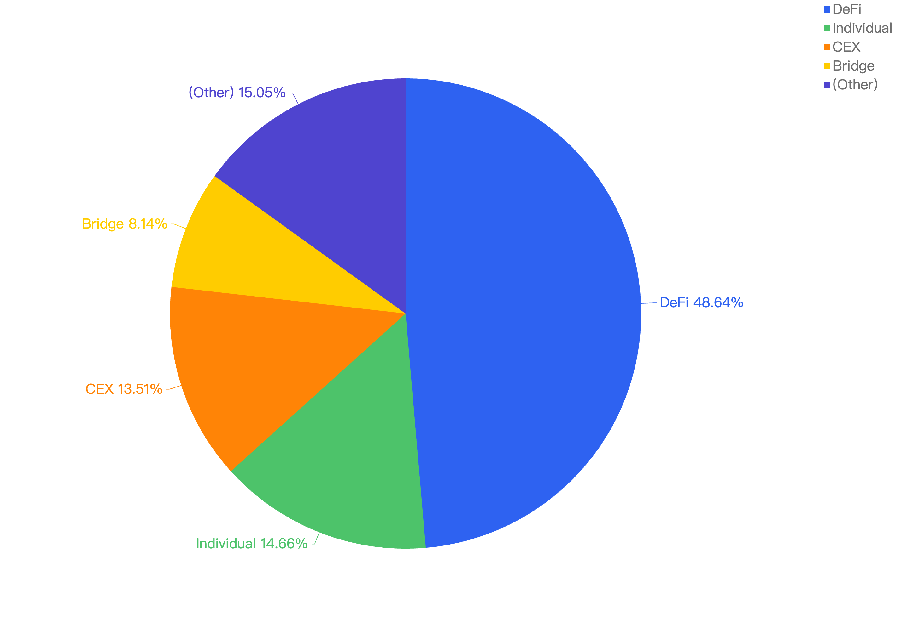

# 2024 End of Year BSC Security Report

## Table of contents
- [Overview](#overview)
- [Disclaimer](#disclaimer)
- [Executive Summary](#executive-summary)
- [Notable developments](#notable-developments)
  - [Developments in the Wallet Drainer Scams](#developments-in-the-wallet-drainer-scams)
  - [Continued rise of DPRK Scams](#continued-rise-of-dprk-scams)
  - [Continued rise of Spoofing Scams](#continued-rise-of-spoofing-scams)
- [Year-over-Year (YoY)](#year-over-year-yoy)
  - [General](#general)
  - [Type of attack vectors](#type-of-attack-vectors)
  - [Type of projects](#type-of-projects)
  - [Chain comparison](#chain-comparison)
- [2024 in focus](#2024-in-focus)
  - [General](#general-1)
  - [Wallet Drainer Analysis](#wallet-drainer-analysis)
  - [Spoofing Analysis](#spoofing-analysis)
  - [Quarter-over-Quarter (QoQ)](#quarter-over-quarter-qoq)
  - [Month-over-Month (MoM)](#month-over-month-mom)
  - [Type of attack vectors](#type-of-attack-vectors-1)
  - [Type of projects](#type-of-projects-1)
- [Conclusion](#conclusion)
- [Appendix](#appendix)
  - [HashDit](#hashdit)
  - [Top 10 Incidents](#top-10-incidents)
  - [2024 highlights](#2024-highlights)

## Overview
This report focuses on security events that happened on BSC in 2024, analyzing the type of projects targeted and sharing the common attack techniques used in 2024, with respect to the financial loss of the incidents.

## Disclaimer
The financial data provided here is accurate based on our own monitoring system and based on the $USD amount of the cryptocurrency involved at the time of the incident. Due to the fluctuating price nature of cryptocurrencies, the total amount loss might differ with the current token valuations.

Furthermore, the financial data might not fully reflect the true “exploited amount” of the incident. This is especially true for scams where the total scammed amount is usually mixed with an initial base amount injected by the scam project party.

## Executive Summary
1. A total of **$62,895,059** was lost across **149** security incidents in 2024
2. This represents a decline of **61%** from 2023 total of **$162,214,631**
3. May saw the most loss, with **$20,624,200** across **9** incidents
4. Q4 was the most costly quarter, at **$31,399,100** from **88** incidents 
5. The most financially damaging attack vector belongs to **Hot Wallet Compromise**, with $**27,040,000** in **6** incidents.
6. BSC ranks **6th** in total losses across chains, representing **3%** of total loss in Web3. This gave an average loss of $422,114 per incident. The 1st place went to Ethereum, representing **53%** of total loss, with **$1,075,000,000** in losses in **326** incidents. This resulted in an average loss of **$3,297,546** per incident.

## Notable developments

### Developments in the Wallet Drainer Scams
Wallet Drainers are a sophisticated form of fraud that preys on users with low security awareness. These scams often operate under a "Scam-as-a-Service" model, allowing individuals to purchase malicious scripts to conduct their own scam campaigns. The primary method involves tricking users into visiting phishing websites and signing scam transactions with their crypto wallets, leading to the theft of their funds. This technique is not limited to a single blockchain but follows the flow of money across various chains. In 2024, Wallet Drainers continue to run wild, spreading havoc across ordinary users who are not careful in the space. Some of the notable instances include:
- Wallet Drainers have extended their reach beyond EVM chains to include networks like TON and Cardano.
- Scammers continue to focus on high-profile events, such as the Pudgy’s PENGU airdrop, to maximize their impact.
- Compromised data from breaches like MailerLite and LastPass have been used to spread phishing scams.
- Drainers have created fake channels and social media accounts on platforms like Telegram and Discord to mislead users.
- Scammers have developed fake meeting software and used social engineering to trick users into downloading malware.
- Targeting commonly used npm packages in crypto projects, such as Solana/Web3.js and LottieFiles, to compromise multiple projects' front ends.
- DNS hijacking incidents, including the major compromise of Squarespace, resulted in significant impacts on many hosted sites, such as Compound and Celer.

### Continued rise of DPRK Scams
DPRK-affiliated personnel continue to target trending protocols and high-net-worth individuals in the Web3 space. Their tactics include impersonating legitimate employees to compromise projects, exfiltrate sensitive data, and steal funds over time. Notable incidents include the compromises of DMM Bitcoin and WazirX exchanges. Additionally, they exploit non-technical vulnerabilities to compromise large Total Value Locked (TVL) Web3 methods.

### Continued rise of Spoofing Scams
Scammers have adopted a new tactic of sending small amounts of real money to unsuspecting victims. This involves creating addresses with similar endings to those that users normally interact with and sending a few pennies. They monitor the mempool and quickly generate these addresses to follow up on original transactions. This spoofing technique has been observed on multiple non-EVM chains, including Solana (with over $3 million in losses) and Tron. The largest recorded damage was $68 million on Ethereum in May.

## Year-over-Year (YoY)

### General
In 2024, HashDit monitored $62,895,059 funds loss on BSC. The amounts lost to exploits have continued to drop significantly since 2022, continuing the downward trend of 2023, with a YoY 61% decrease in damages, as seen from the figure below.

Figure 1: Total amount stolen funds (in dollars) on BSC over the last 5 years

In total, there were 149 security incidents on BSC, representing a 64% year-over-year decrease from 2023, dropping even lower than the 2022 incident count of 286. The average number of incidents per month decreased from 34 to 12. Figure 2 shows that the increasing trend of security incidents has finally been broken in 2024 on BSC, which could signify a positive sign and turnaround in the space.

Figure 2: Number of incidents on BSC over the last 5 years

### Type of attack vectors
Analyzing the attack vectors trends based on Financial losses, both Hacks and Scams have dropped significantly from 2023, with Hacks accounting for $50.6m (31% decrease) and Scams accounting for $12.1m (86% decrease) in 2024.

Figure 3: Financial losses per attack vector over the last 5 years

In terms of incident count, both Hacks and Scams have also shown a positive reversal trend from 2023, with 123 Hacks (41% decrease) and 25 Scams (87% decrease) in 2024.

Figure 4: Number of incidents per attack vector over the last 5 years

A comparative analysis of the decrease in percentages reveals a significant reduction in both hacks and scams. This positive trend can be attributed to several key factors. Enhanced security measures on the BSC have played a crucial role in mitigating these threats. The implementation of advanced security protocols and continuous monitoring has made it more difficult for malicious actors to exploit vulnerabilities.

Additionally, users are becoming more vigilant and knowledgeable about potential scams. There is a growing awareness among the community about the importance of conducting thorough due diligence (DD) before investing in new projects. This proactive approach by users, combined with the robust security efforts on BSC, has contributed to a safer and more secure environment in the crypto space.

### Type of projects
This chart represents the type of projects that were exploited since 2020.

Figure 5: Security Incidents per type of project over the last 5 years

It is clear that DeFi projects are still the main targets for crypto hackers, with 104 in 2024, still a noticeable drop from 70% decrease from 2023. Many of these projects are relatively obscure and are generally categorized under decentralized finance (DeFi). They typically involve staking or rewards mechanics, which attract users looking for high returns on their investments. Despite their potential for profitability, the lack of visibility and recognition makes these projects more susceptible to risks and scams. As a result, it is crucial for investors to exercise caution and conduct thorough research before engaging with such DeFi projects.

### Chain comparison
The figure below shows the comparison between the chains with the top funds losses to exploits over the last 4 years.

BSC (in green) has shown positive steps, figures dropping significantly since 2021.

On the other hand, Ethereum (in blue) has continued to be the largest hitting chain since 2021, maintaining its lead at the forefront. At the same time, other chains like BTC (in yellow), Blast (in dark blue) and XRP (in light purple) have shown large increases from 2023.

Figure 6: Biggest financial losses across chains over the last 5 years

## 2024 in focus

### General
In total, roughly $62.8 million were lost to 149 security incidents on BSC.

Interestingly, when removing the top 3 largest incidents, the total financial loss drops down to just above $30m, a large 52% drop from the total amount loss of 2024. This signifies that most of the damage is still attributed to 1 or 2 large hitting cases.

Figure 7: Amount of stolen funds in dollars excluding the 3 largest incidents

By observing the quarterly and monthly trends below, there are some interesting observations to be made.

### Wallet Drainer Analysis
In 2024, we closely monitored Drainer operations, observing over 500,000 drainer transactions on BNB Chain, resulting in a total loss exceeding $20 million USD.

The most significant incident occurred on December 11, 2024, when a user [lost](https://bscscan.com/tx/0x1cf2084e9c5965d37610e2ba40db504670114db3abecef8fc67f89d3f4da9faa) $8.3 million worth of SolvBTC.BBN and SolvBTC tokens to an Angel Drainer address on BNB Chain. Other incidents did not surpass the $1 million mark, with the second-largest being an $833,000 [loss](https://bscscan.com/tx/0x400b7583b892024db19940e2e74a26b22b188196e3c6cbff4e6663295a50daed) in January and another $830,000 [loss](https://bscscan.com/tx/0x0a00ec522a95a517bfb2914e3a4b606163e604f6c9f10287a3dc3ea2a2dfb1bc) in July.

For comparison, on Ethereum, the total drainer amount is much more staggering, exceeding $500 million USD combined. The highest single incident involved $55 million worth of DAI tokens [stolen](https://etherscan.io/tx/0xf70042bf3ae7c22f0680f8afa078c38989ed475dfbe5c8d8f30a50d4d2f45dc4) in August 2024, with these funds still residing in the scammer's wallets to date.

This highlights the growing need to educate users on security awareness when signing transactions and to adopt more security tools to aid in understanding what they are signing.

### Spoofing Analysis
In 2024, spoofing and address poisoning scams continued to proliferate. We monitored over 30 groups conducting these scams on Ethereum and BNB Chain, resulting in more than $80 million in losses across all chains. Our analysis revealed that most of these groups have a lifespan of less than one month, with the largest groups (those with the most scam funds invested) operating for more than half a year.

These groups employed various tactics, including:
- Using fake tokens that mimic actual funds transferred.
- Sending 0 amounts of the actual funds transferred.
- Sending small amounts of the actual funds being transferred.

These measures were used to deceive victims and execute scams effectively.

Some of the scam profits were exited through non-KYC platforms like Exch and FixedFloat, or they were bridged to other less traceable chains such as Litecoin or Tron.

### Quarter-over-Quarter (QoQ)
1. On BNB Chain, Q4 sees significant increase in fiat losses compared to the rest of the quarters

Fiat losses surged by 121%, rising from $14.2 million in Q3 to $31.4 million in Q4. In fact, it represented nearly half of the total incident losses in 2024. This significant increase was primarily driven by two major incidents in Q4 2024. The first was the Radiant case, which resulted in losses amounting to $17.8 million. The second involved an individual who fell victim to a Drainer incident, suffering losses of $7.8 million. These two events were among the most damaging losses of the year, contributing substantially to the overall increase in fiat losses.

Figure 8: Financial losses across chains over the last 4 quarters in 2024

2. Across all chains in Web3, the overall losses dropped in Q4 as compared to other quarters. This is likely due to increased security education and awareness among users, even though threat actors continue to proliferate in the Web3 space. Enhanced knowledge and vigilance have empowered users to better protect their assets and avoid scams, contributing to the reduction in overall losses.

Figure 9: Chain comparison fund losses in Q4

### Month-over-Month (MoM)
The average monthly loss is calculated to be ~$5.2m, with 9 out of the 12 months being below this average reference line.

Figure 10: Amount of stolen funds in dollars per month in 2024

In those months above the reference line, the significant increase in fiat loss was due to one or two singular, abnormally large security events. For example, in September, there were two major incidents: the BingXOfficial hot wallet compromise for approximately $6.8 million and the CUT2024CUT price manipulation vulnerability for around $1.45 million. This indicates that, on average, losses per incident are relatively small.

Analyzing the trend in the number of security incidents, the chart shows that the number of cases largely peaked in April, September, and November, with the average being around 12 incidents per month.

Figure 11: Number of projects impacted by security exploits

Interestingly, even though April has the one of the highest number of security incidents at 17, the financial loss only stands at $2.7m which is more than half of September’s data. With a nearly similar count at 18, September’s financial loss is more than double, at $9.4m.

### Type of attack vectors
Out of the 149 security incidents, the majority were attributed to hacks, accounting for 82.55%. Scams made up 16.78%, and improper management (operational issues caused by the team's mismanagement) accounted for 0.67%.

Figure 12: Proportion of different type of exploits

This is synchronous with the financial loss of these security incidents. As shown in Figure 12, hacks resulted in a financial loss of $50.6 million, which is significantly more than the $12.1 million loss from scams.

Figure 13: Financial impact measured in dollars comparing different types of incidents

For further analysis of the specific attack vectors, this figure below displays this against the financial loss in 2024.

Figure 14: Proportion of the funds lost comparing the different type of vulnerabilities

A worrying 49.01% of incidents were attributed to **Hot Wallet Compromise**, where CEXs or protocols were careless with managing security around their privileged accounts or lacked security awareness. This led to threat actors breaching their infrastructure and obtaining keys to drain funds. 

The second largest contributor was **Phishing** among regular users, who might store substantial amounts of funds in hot wallets without being aware of the threats. Clicking on fake sites can lead to fake signatures being generated, resulting in stolen funds. 

The third largest contributor was **Private Key Compromise** within other entities, highlighting the importance of securing keys properly and following proper security guidelines in both Web2 and Web3 environments.

### Type of projects
When focusing on the project type versus financial loss, 48.64% of financial losses are attributed to DeFi projects. The trend of DeFi continues to lead across all major chains, including BSC. However, some developers might not be well-versed in security when writing their smart contracts, leading to investors bearing the brunt of the compromises.

The second most targeted type were individuals at 14.66%, followed by CEX platforms at 13.51%. Individuals continue to be a main target for scammers, especially with the rise in the crypto market bringing in a new wave of investors whose security awareness may not be strong. Wallets and security extensions play a vital role in protecting these users.

CEX platforms also continue to be targets since they hold large amounts of funds. If the keys are not managed and stored safely, they become easy targets for hackers.

Figure 15: Proportion of funds lost comparing the type of project

## Conclusion
In 2024, we observed a notable shift in the landscape of security incidents. While the number and amount of hacks have dropped, scams are on the rise, highlighting the need for users to be more security aware. Phishing remains a persistent threat, and it is crucial for users to stay vigilant against such tactics.

Our HashDit user products, such as the Chrome extension and Snaps, could have potentially prevented over $25 million in losses. We highly recommend these free products to enhance user security. Additionally, our B2B products, including monitoring, auditing, and prevention tools, will continue to serve the top protocols on BNB Chain, protecting them from threat actors.

Malicious actors will continue to lurk in the background, and we are committed to staying ahead of them for the sake of the Web3 community. BSC remains a strong competitor, outperforming Ethereum in terms of daily active users and transactions. Although 2023 showed better performance in terms of total funds lost to exploits, it is undeniable that scammers and hackers will continue to evolve their methods until stricter measures are in place to hold them accountable.

Within HashDit, we will keep improving by:
- Implementing a comprehensive set of stringent audit guidelines that all top TVL projects must meet before deploying significant features on-chain.
- Collaborating promptly with key stakeholders to conduct in-depth root cause analyses on all major incidents, ensuring similar issues are not present in the top TVL projects.
- Working closely and sharing intel within members to identify potentially fraudulent projects at an early stage, particularly those amassing substantial liquidity.
- Monitoring any malicious activities related to hacks and scams vigilantly and transmitting alerts via numerous channels such as Twitter and Telegram to rapidly inform the community.
- Continually extending HashDit’s influence to the community by regularly publishing articles and reports related to hack and scam techniques, strengthening users' knowledge regarding security awareness in the crypto space.

We remain dedicated to protecting the Web3 community and ensuring a safer environment for all users and protocols.

## Appendix

### HashDit
#### User-Facing Products
1. **[HashDit Chrome Extension](https://chromewebstore.google.com/detail/hashdit/coegijljhiejhdodjbnlglffjomlbgmi?utm_source=ext_app_menu):**
   The HashDit Chrome Extension provides an extra layer of protection when interacting with websites involving digital assets. It operates between websites and extension-based wallets like TrustWallet and MetaMask, analyzing transactions, identifying risk factors, and alerting users to potential threats.

2. **[HashDit MetaMask Snaps](https://snaps.metamask.io/snap/npm/hashdit-snap-security/)**:
The HashDit MetaMask Snaps offers similar protective features as the Chrome Extension, focusing on showing risks when users are on phishing sites or signing risky transactions. While it has fewer functions compared to the Chrome Extension, it still provides essential security alerts to help users avoid scams.

Business-Facing Products

1. **[Novel Prevention Product](https://hashdit.github.io/hashdit/docs/transaction-prevention/introduction)**:
Our novel prevention product can stop hacks in real-time once any previously set invariants are broken. This proactive approach ensures that any deviations from expected behavior are immediately addressed, preventing potential exploits and safeguarding assets.

2. **Monitoring**:
Our monitoring service detects risky events both on-chain and off-chain. On-chain monitoring includes tracking sensitive events such as ownership changes or malicious upgrades, while off-chain monitoring covers social media compromises and DNS hijacks. This comprehensive monitoring allows for quick responses to minimize financial losses, with alerts shared via multiple channels like Twitter and Telegram.

3. **[Threat Intelligence Product API](https://hashdit.github.io/hashdit/docs/category/hashdit-api-1)**:
The Threat Intelligence Product API provides a wholesale, all-in-one solution that flags risks associated with addresses or URLs in real-time. By gathering and detecting various types of information, this API offers accurate and timely detection of scam/exploit risks, helping businesses stay ahead of potential threats.

#### Commitment to Security

HashDit remains dedicated to improving security for both users and businesses in the Web3 community. By implementing stringent audit guidelines, collaborating with key stakeholders, and sharing intelligence, we aim to create a safer environment for all. Our educational efforts continue to equip builders, investors, and users with the knowledge needed to adopt a security-first mindset, ensuring the Web3 ecosystem becomes a safer place for everyone.

#### Top 10 Incidents

1. Radiant
   - Attack Vector: Hot Wallet Compromise
   - Damage: $17,800,000
   - Description: Hacker gained signatures of three owners of an 11-threshold multisig. The attacker deployed a malicious contract (0xf0fc) to drain Radiant's lending pool. Devices were compromised with malware, affecting at least three contributors. The malicious implementation continues to drain funds from users who have approved it.

2. User
   - Attack Vector: Phishing
   - Damage: $8,300,000
   - Description: A user (@0xYuanbo) lost ~$8.3m worth of SolvBTC.BBN & SolvBTC tokens to an Angel Drainer address on BSC due to two transfer transactions signed to scam Create2 addresses. Most funds sent to the Drainer Customer were burned by the Solv Protocol.

3. BingXOfficial
   - Attack Vector: Hot Wallet Compromise
   - Damage: $6,840,000
   - Description: On September 20, BingX's technical team detected abnormal network access, suspecting a hacker attack on their hot wallet. Emergency measures were taken, including asset transfer and withdrawal suspension.

4. ALEXLabBTC
   - Attack Vector: Private Key Compromise
   - Damage: $4,300,000
   - Description: Hacker compromised a key and made a malicious proxy upgrade. The Alex deployer account performed five identical upgrades to the “Bridge Endpoint” contract on BNB Smart Chain, resulting in the removal of approximately $4.3 million.

5. BullcoinBSC
   - Attack Vector: Hot Wallet Compromise
   - Damage: $2,400,000
   - Description: Multisig transferred ownership to a compromised address, which later upgraded the contract with a backdoor. At least three of the project's multisig signer addresses were compromised, likely due to centralization of the keys.

6. MEV bot
   - Attack Vector: Lack of Validation
   - Damage: $2,200,000
   - Description: Hacker invoked the fallback function logic with a specific function selector. Funds were bridged to ETH within nine hours of deployment. Executors included the hacker.

7. NFPrompt
   - Attack Vector: Private Key Compromise
   - Damage: $1,500,000
   - Description: Hackers compromised wallets, including those of NFP’s contract administrators, gaining control of victims' funds, including a portion of NFP treasury and ecosystem fund.

8. CUT2024CUT
   - Attack Vector: Price Manipulation
   - Damage: $1,450,000
   - Description: The $CUT token's price protection mechanism was vulnerable to price manipulation. The exploiter gained extra $CUT tokens and sold them, profiting ~$1.4m from the BUSD-CUT pancake pair.

9. Duelbits
   - Attack Vector: Hot Wallet Compromise
   - Damage: $1,100,000
   - Description: The Duelbits crypto casino and sports betting website was drained. The thief accessed a Duelbits wallet, likely through a private key compromise.

10. CoinsPaid
    - Attack Vector: Hot Wallet Compromise
    - Damage: $1,000,000
    - Description: On July 22, CoinsPaid experienced a hacker attack, likely by the Lazarus group from DPRK.

#### 2024 highlights

- Our Chrome Extension user base grew exponentially, reaching almost 1,000 users, which is a growth of more than 300% from the start of the year.

- We joined partnerships with critical infrastructure platforms in the space, such as 48Club and Token Pocket, to reduce scams and frauds on BNB Chain.

- Released countless tweets to raise user security awareness, covering topics such as spotting fake Pig Butchering sites, identifying phishing scams like Drainers and Spoofers, and numerous other scam warnings. These tweets amassed over 788,000 views and attracted more than 2,400 new followers to our HashDit X account.

